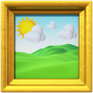

<!-- Improved compatibility of back to top link: See: https://github.com/othneildrew/Best-README-Template/pull/73 -->
<a name="readme-top"></a>
<!--
*** Thanks for checking out the Best-README-Template. If you have a suggestion
*** that would make this better, please fork the repo and create a pull request
*** or simply open an issue with the tag "enhancement".
*** Don't forget to give the project a star!
*** Thanks again! Now go create something AMAZING! :D
-->


<!-- PROJECT SHIELDS -->
<!--
*** I'm using markdown "reference style" links for readability.
*** Reference links are enclosed in brackets [ ] instead of parentheses ( ).
*** See the bottom of this document for the declaration of the reference variables
*** for contributors-url, forks-url, etc. This is an optional, concise syntax you may use.
*** https://www.markdownguide.org/basic-syntax/#reference-style-links
-->
[![Contributors][contributors-shield]][contributors-url]
[![Forks][forks-shield]][forks-url]
[![Stargazers][stars-shield]][stars-url]
[![Issues][issues-shield]][issues-url]
[![Apache License][license-shield]][license-url]


<!-- PROJECT LOGO -->
<br />
<div align="center">
  <a href="https://github.com/AtticusLv/3D-room-practice">
    
  </a>

<h3 align="center">3D Room Practice</h3>

  <p align="center">
    A 3D room practice built with vuejs, threejs, spring webflux, blender modeling. Including some basic tutorial about threejs, blender and webflux.
    <br />
    <a href="https://github.com/AtticusLv/3D-room-practice"><strong>Explore the docs »</strong></a>
    <br />
    <br />
    <a href="https://github.com/AtticusLv/3D-room-practice">View Demo</a>
    ·
    <a href="https://github.com/AtticusLv/3D-room-practice/issues">Report Bug</a>
    ·
    <a href="https://github.com/AtticusLv/3D-room-practice/issues">Request Feature</a>
  </p>
</div>


<!-- TABLE OF CONTENTS -->
<details>
  <summary>Table of Contents</summary>
  <ol>
    <li>
      <a href="#about-the-project">About The Project</a>
      <ul>
        <li><a href="#built-with">Built With</a></li>
      </ul>
    </li>
    <li><a href="#roadmap">Roadmap</a></li>
    <li><a href="#contributing">Contributing</a></li>
    <li><a href="#license">License</a></li>
    <li><a href="#contact">Contact</a></li>
  </ol>
</details>


<!-- ABOUT THE PROJECT -->
## About The Project

![Practice Draft][draft-screenshot]

To learn modeling and threejs, this 3d room practice is started. And the life-cylcle of whole engineering and work will be recorded here.

The whole practice will be including blew parts:
- tutorial: this will be listed in **doc** folder, including blender, threejs, vuejs, backend knowledge and a little devops
- frontend: using vuejs framework and threejs engine, to build a 3D web project
  - user ui
  - admin ui 
- backend: using spring webflux to provide http restful api to frontend

### Built With

* [![Vue][Vue.js]][Vue-url]
* [![ThreeJS][Three.js]][threejs-url]


<p align="right">(<a href="#readme-top">back to top</a>)</p>


<!-- ROADMAP -->
## Roadmap

- [ ] 1. Basic Knowledge Learning
  - [ ] Modeling(Blender)
  - [ ] Web 3D(ThreeJS)
  - [ ] Web Framework(VueJS)
- [ ] 2. Engineering
  - [ ] 
- [ ] 3. Deployment
    - [ ] Dockerfile
    - [ ] Build and deploy frontend
    - [ ] Build and deploy backend
- [ ] 4. Test & Improve


<!-- CONTRIBUTING -->
## Contributing

Any contribution is appreciated!

If you have any idea that would make the practice better, please fork the repo and create a **PR**. You can also simply open an issue with the tag "enhancement".

```
Don't forget to give the project a star! Thanks again!
```

1. Fork the Project
2. Create your Feature Branch (`git checkout -b feature/yyyyMMdd_newFeature`)
3. Commit your Changes (`git commit -m 'add an amazing feature'`)
4. Push to the Branch (`git push origin feature/yyyyMMdd_newFeature`)
5. Open a Pull Request


<!-- LICENSE -->
## License

Distributed under the APACHE 2.0 License. See `LICENSE.txt` for more information.


<!-- CONTACT -->
## Contact

Your Name  - ppzhuo@126.com

Project Link: [https://github.com/AtticusLv/3D-room-practice](https://github.com/AtticusLv/3D-room-practice)


<p align="right">(<a href="#readme-top">back to top</a>)</p>


<!-- MARKDOWN LINKS & IMAGES -->
<!-- https://www.markdownguide.org/basic-syntax/#reference-style-links -->
[contributors-shield]: https://img.shields.io/github/contributors/AtticusLv/3D-room-practice.svg?style=for-the-badge
[contributors-url]: https://github.com/AtticusLv/3D-room-practice/graphs/contributors
[forks-shield]: https://img.shields.io/github/forks/AtticusLv/3D-room-practice.svg?style=for-the-badge
[forks-url]: https://github.com/AtticusLv/3D-room-practice/network/members
[stars-shield]: https://img.shields.io/github/stars/AtticusLv/3D-room-practice.svg?style=for-the-badge
[stars-url]: https://github.com/AtticusLv/3D-room-practice/stargazers
[issues-shield]: https://img.shields.io/github/issues/AtticusLv/3D-room-practice.svg?style=for-the-badge
[issues-url]: https://github.com/AtticusLv/3D-room-practice/issues
[license-shield]: https://img.shields.io/github/license/AtticusLv/3D-room-practice.svg?style=for-the-badge
[license-url]: https://github.com/AtticusLv/3D-room-practice/blob/master/LICENSE.txt
[draft-screenshot]: doc/images/draft.png
[Next.js]: https://img.shields.io/badge/next.js-000000?style=for-the-badge&logo=nextdotjs&logoColor=white
[Next-url]: https://nextjs.org/
[Vue.js]: https://img.shields.io/badge/Vue.js-35495E?style=for-the-badge&logo=vuedotjs&logoColor=4FC08D
[Vue-url]: https://vuejs.org/
[Three.js]: https://img.shields.io/badge/three.js-000000?style=for-the-badge&logo=threedotjs&logoColore=grey
[threes-url]: https://threejs.org/
